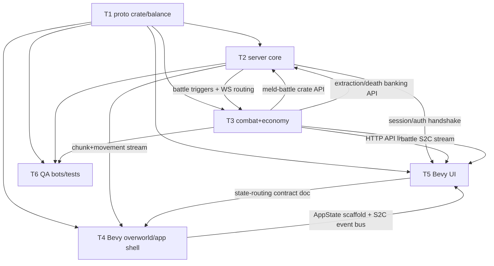

# MELDWORLD Build Plan

Execution plan for AI agent teams. Contracts: `GDD.md`, `CANON.md` (wins on conflict), and `spec/`. Read `CANON.md §S` before writing any code — system boundaries are non-negotiable.

**Spec citation convention:** detail files are cited as `parent.md → detail` (e.g., `spec/interfaces/realtime-protocol.md → battle` means the battle detail file adjacent to that index). Resolve to the actual detail filename in `spec/` at task start.

---

## 1. Team Decomposition

### Repo layout (fixed; ownership boundaries)

```
/shared/meld-proto/           T1  shared wire-type crate (plain Rust: envelope, DTOs, enums; consumed by server AND client)
/balance/balance.toml         T1  all [TUNABLE] constants (CANON.md §B)
/server/crates/meld-server/   T2  server binary, WS gateway, session
/server/crates/meld-world/    T2  world gen, chunks, movement, interest mgmt
/server/crates/meld-run/      T2  run lifecycle, instances, disconnect/sleep
/server/crates/meld-battle/   T3  ATB engine
/server/crates/meld-econ/     T3  vault, gear, meld, stalls, contracts, leaderboards
/server/crates/meld-api/      T3  HTTP API (axum), auth/sessions (bcrypt, Postgres)
/server/crates/meld-db/       T3  Postgres persistence layer, migrations
/client/crates/meld-client/   T4  Bevy app shell + overworld: rendering, HD-2D pipeline, prediction
/client/crates/meld-ui/       T5  Bevy UI screens: auth, ATB battle, hub, shop/bounty/leaderboards
/client/app-states.md         T5  screen/state-routing contract (T4↔T5, D16)
/qa/                          T6  claims, conformance tests, bots, load harness
/.github|ci/                  T1  CI pipeline (all teams add jobs, T1 owns structure)
```

### T1 — Shared Protocol & Schema

| | |
|---|---|
| **Mission** | Single source of truth for every wire type, message envelope, DTO, enum, and error code, published as one plain Rust crate (`meld-proto`) consumed directly by both server and client — no codegen, no second language; own `balance/balance.toml` and CI skeleton. |
| **Owns** | `/shared/meld-proto`, `/balance/balance.toml`, CI pipeline structure, wire-type change review. |
| **Contract specs** | `spec/interfaces/data-models.md` (+ all 6 detail files), `spec/interfaces/realtime-protocol.md` (+ session, movement-world, battle, run-social), `spec/interfaces/http-api.md` (+ all 6 detail files), `CANON.md §I` (IDs, envelope, error codes), `CANON.md §G` (canonical names), `spec/edge-cases/limits.md` (field bounds). |
| **Non-goals** | No business logic, no serialization logic beyond plain serde derives + validated field types, no gameplay constants decisions (values come from CANON/spec; T1 only hosts them). |
| **Consumes** | Nothing from other teams. Root of the dependency graph. |

### T2 — Rust Server Core (world, movement, runs, disconnect)

| | |
|---|---|
| **Mission** | Authoritative overworld: seeded world gen, chunk streaming, movement validation, instance/run lifecycle, disconnect/sleep/ward handling, WS gateway + session. |
| **Owns** | `meld-server`, `meld-world`, `meld-run`. |
| **Contract specs** | `spec/behaviors/world-generation.md`, `spec/behaviors/run-lifecycle.md`, `spec/behaviors/disconnect-handling.md`, `spec/behaviors/async-interaction.md` (overworld half: drops, ward placement, heal-into-battle routing), `spec/interfaces/realtime-protocol.md` → session, movement-world, run-social; `spec/edge-cases/limits.md`. |
| **Non-goals** | No ATB math (calls T3's `meld-battle` API), no direct DB writes for persistent state (calls `meld-econ`/`meld-db` interfaces at run end), no rendering assumptions. |
| **Consumes** | T1 `meld-proto` (all messages), T3 `meld-battle` crate API (start/tick/merge/resolve battles), T3 `meld-econ` banking API (extraction → vault, death → durability). |

### T3 — Rust Server Combat + Economy Services

| | |
|---|---|
| **Mission** | Server-authoritative ATB engine (100 ms tick, gauges, actions, merge, flee, auto-defend); the entire HTTP API incl. username+password auth (bcrypt cost 12, opaque Bearer session tokens, single-use realtime tickets — D17); persistence in **Postgres** (D18: schema, migrations, snapshots); economy transactions (escrow, tax, repairs); leaderboards/seasons. |
| **Owns** | `meld-battle`, `meld-econ`, `meld-api`, `meld-db` (the Postgres schema and everything that touches it). |
| **Contract specs** | `spec/behaviors/combat-atb.md`, `spec/behaviors/economy.md`, `spec/behaviors/meta-progression.md`, `spec/behaviors/endgame-seasons.md`, `spec/interfaces/http-api.md` (+ all 6 details), `spec/interfaces/realtime-protocol.md` → battle; `CANON.md §B` (formulas), `CANON.md §D17` (auth), `CANON.md §D18` (Postgres), `spec/edge-cases/limits.md`. |
| **Non-goals** | No movement/chunk logic, no WS connection management (T2's gateway routes battle messages into `meld-battle`), no client code. |
| **Consumes** | T1 `meld-proto` + `balance.toml`, T2 battle-trigger events + WS routing (in-process API defined jointly, T3 proposes trait, T2 implements gateway side). |

### T4 — Bevy Overworld Client & Art Pipeline

| | |
|---|---|
| **Mission** | The Bevy app shell + overworld: rendering, tile/chunk display, input → movement intents, client prediction + interpolation, other-player presence, drops/wards/sleeping avatars/battle markers, collision presentation. Owns the **HD-2D art pipeline (D16)**: sprite/tile import pipeline, 3D-lit 2D rendering, depth-of-field and particle passes. Asset *creation* is out of scope for agent teams — placeholder assets are acceptable through M5. |
| **Owns** | `/client/crates/meld-client` (app shell, overworld, HD-2D render path, asset pipeline). |
| **Contract specs** | `spec/interfaces/realtime-protocol.md` → session, movement-world, run-social; `spec/behaviors/world-generation.md` (tile semantics, biome tables — render only), `spec/behaviors/async-interaction.md` (drop/pickup UX), `CANON.md §S` (never computes outcomes), `CANON.md §D16` (HD-2D direction). |
| **Non-goals** | No UI screens (T5's job — battle/hub/menu screens live in `meld-ui`), no HTTP calls, no authoritative collision/combat, no persistence, no hand-authored final art. Prediction is presentation-only and must reconcile to server snapshots. |
| **Consumes** | T1 `meld-proto` crate, T2 live WS server (movement/chunk/presence), T5 state-routing contract (shared Bevy app states + transition triggers — defined jointly in `client/app-states.md`, T5 owns doc). |

### T5 — Bevy UI Team

| | |
|---|---|
| **Mission** | All in-app UI, built in Bevy in the same client codebase as T4: auth screens, ATB battle UI (dynamic multi-party layout), hub UIs (Vault, Training Ground, Stall shop, Bounty Board, crafting/repair, leaderboards), menus; the screen/state-routing layer (shared Bevy app states: `Overworld ↔ Battle ↔ HubScreen` transitions); HTTP client plumbing in Rust. |
| **Owns** | `/client/crates/meld-ui` and the `client/app-states.md` state-routing contract doc. |
| **Contract specs** | `spec/interfaces/http-api.md` (+ all 6 details), `spec/interfaces/realtime-protocol.md` → session, battle, run-social; `spec/behaviors/combat-atb.md` (render/intent semantics only), `spec/behaviors/economy.md` + `meta-progression.md` + `endgame-seasons.md` (screen flows), `spec/edge-cases/limits.md` (input validation mirrors), `CANON.md §D16/§D17`. |
| **Non-goals** | Never computes combat outcomes, damage, or prices — displays server results only. No direct DB. No overworld/world rendering (that's T4's `meld-client`; T5 screens are Bevy states layered in the same app). |
| **Consumes** | T1 `meld-proto` crate, T3 HTTP API + battle S2C stream (via T2 gateway), T4 app shell: shared `AppState` scaffold, overworld view, and the S2C event bus that drives state transitions. |

### T6 — QA / Verification

| | |
|---|---|
| **Mission** | Turn `spec/` into numbered claims and executable conformance tests via the spec-extractor pipeline (`spec-derive-claims`, `spec-derive-interface-claims`, `spec-generate-claim-tests`, `spec-verify-compliance`); own integration harness, headless bot clients, load/chaos tooling; gate every milestone. |
| **Owns** | `/qa` (claims files, conformance suites, bot framework, load harness, chaos scripts, milestone gate reports). |
| **Contract specs** | ALL of `spec/` — T6 is the enforcement arm of the whole spec tree, plus `CANON.md §B` networking targets for load tests. |
| **Non-goals** | Never patches production code to make tests pass (files findings against owning team); doesn't own unit tests (each team writes their own — T6 owns cross-boundary conformance). |
| **Consumes** | T1 `meld-proto` crate (bots speak the real wire format), T2/T3 running server (docker-compose target from M0), the T4/T5 client build for smoke automation. |

---

## 2. Dependency Graph



| # | Blocked | Blocker | Satisfying artifact | Needed by |
|---|---------|---------|--------------------|-----------|
| D-1 | T2, T3, T4, T5, T6 | T1 | `meld-proto` Rust crate v0.1 with session/movement/error types (consumed by server + client workspaces); `balance.toml` v0.1 | M0 exit |
| D-2 | T4 | T2 | WS server streaming ≥1 chunk + movement snapshots against localhost | M1 |
| D-3 | T5 | T3 | `/v1/auth/login` (username+password, bcrypt-verified, opaque session token + realtime ticket) + `/v1/players/me` live | M1 |
| D-4 | T2 | T3 | `meld-battle` crate: `start_battle / submit_intent / tick / merge / resolve` trait | M2 |
| D-5 | T5 | T3 | Battle S2C messages emitted end-to-end (via T2 gateway) | M2 |
| D-6 | T2 | T3 | `meld-econ` banking API: `bank_extraction(backpack)`, `apply_death(gear)` | M2 |
| D-7 | T5 | T4 | Shared `AppState` scaffold merged in `meld-client` (state enum, transition hooks, UI-screen registration points) + `client/app-states.md` agreed | M1 (stub), M2 (real) |
| D-8 | T6 | T2+T3 | `docker compose up` one-command server | M0 exit |
| D-9 | T5 | T3 | economy endpoints (stalls, contracts, repairs) | M4 |
| D-10 | T6 gates | spec/ authors | spec files frozen per-milestone (see §5) | each M gate |

**Parallelism note:** T2 and T3 are peers, not a chain — they integrate through two narrow in-process traits (D-4, D-6) that must be PR'd in week 1 of M1 as `.rs` trait definitions with mock impls, so each side codes against mocks until M2 integration.

---

## 3. Milestones

Every criterion is a binary check runnable by an agent (command or conformance test ID). A milestone gate = all criteria green + T6 conformance suite for that milestone green.

### M0 — Scaffolding, schema pipeline, CI
| # | Acceptance criterion |
|---|---|
| M0.1 | `cargo build --workspace` passes from clean clone for both the server and client workspaces. |
| M0.2 | Wire stability: every message/DTO in `meld-proto` round-trips byte-identically against committed golden fixtures; CI fails on fixture drift without a versioned `meld-proto` bump. |
| M0.3 | Server and client workspaces resolve the identical `meld-proto` version (CI lockfile check — one crate, no forked copies); a `session.hello` envelope round-trip test passes against the golden fixture. |
| M0.4 | `balance.toml` parses and contains every `[TUNABLE]` constant named in `CANON.md` §D/§B; server crate loads it at boot (test asserts no hardcoded duplicates via lint script). |
| M0.5 | `docker compose up` starts server + Postgres (D18); `GET /v1/healthz` returns 200 and the server has applied migrations against Postgres. |
| M0.6 | CI runs on every PR: fmt, clippy `-D warnings`, unit tests, golden-fixture freshness, per-team test suites. |
| M0.7 | T6 has run `spec-derive-interface-claims` over `spec/interfaces/` and committed numbered claims to `/qa/claims/interfaces/`. |

### M1 — Walking skeleton
| # | Acceptance criterion |
|---|---|
| M1.1 | `POST /v1/auth/login` (username + password per D17) issues an opaque Bearer session token + a single-use realtime ticket; bad credentials return `unauthorized` envelope per `CANON.md §I` (conformance test `qa/conformance/http/auth`). |
| M1.2 | WS connect presenting the realtime ticket completes `session.*` handshake per `spec/interfaces/realtime-protocol.md → session`; invalid, expired, or already-used ticket gets documented close code. |
| M1.3 | Server generates and streams the chunk at world origin (64×64 tiles, seeded, deterministic: same seed → identical tile hash across two boots). |
| M1.4 | Bot client sends movement intents; server-validated position echoes in snapshots at 10 Hz ±20% (measured over 30 s). |
| M1.5 | Two bot clients in the same instance each observe the other's position within 300 ms of movement (T6 harness asserts). |
| M1.6 | Illegal move (wall clip / speed > `limits.md` cap) is rejected: server position does not change (conformance test). |
| M1.7 | Bevy app logs in via the T5 auth screen and transitions to the `Overworld` app state rendering the origin chunk with the local avatar moving (headless integration smoke via bot-driven screenshot diff acceptable). |
| M1.8 | Passwords are stored **only** as bcrypt hashes (cost 12) in Postgres: after registration, the `password_hash` column parses as a `$2*$12$` bcrypt hash, and the plaintext appears nowhere in the DB dump or server logs captured during the test. |
| M1.9 | Login with an unknown username and login with a wrong password return **identical** responses: same status, same error envelope byte-for-byte modulo `request_id` (no username-enumeration oracle; conformance test asserts equality). |

### M2 — Core loop vertical slice (Forest, one monster, full loop)
| # | Acceptance criterion |
|---|---|
| M2.1 | Party of 1 enters maze from Center Hub: `Run` created, `run_level == base_run_level(center) == 1`, empty Backpack (assert via `run-social` messages + `/v1/runs/{id}`). |
| M2.2 | Forest biome (d 0–100) generates with ≥1 monster spawn type; touching a monster opens a `Battle` server-side and emits battle S2C to the client. |
| M2.3 | Full ATB battle completes server-side: gauge fills at `speed_stat/400` per 100 ms tick, intents resolve, victory awards XP + loot to Backpack (conformance test drives via battle C2S only — no client math). |
| M2.4 | 15 s action timeout triggers auto-defend (test with a silent bot). |
| M2.5 | Extraction at a portal banks Backpack into Vault atomically; `GET /v1/vault` reflects items; Run status `extracted`. |
| M2.6 | Death deletes Backpack + run level; blue-chest gear returns at `max_durability × 0.9` rounded down; red-chest gear in Backpack is gone (asserted via vault-gear endpoints). |
| M2.7 | The Bevy ATB battle screen (T5, entered via the `Overworld → Battle` state transition) plays a complete battle against the live server: displays gauges/HP from S2C only (fault-injection test: server sends absurd damage number, UI shows it — proving no client-side recompute). |
| M2.8 | T6 `spec-generate-claim-tests` suite for `run-lifecycle` + `combat-atb` claims: 100% of M2-tagged claims pass. |
| M2.9 | HD-2D render path (D16) is live for the M2 slice: sprites/tiles render in a 3D-lit scene with depth-of-field and particle passes enabled, verified by screenshot diff against goldens on a fixed seed (placeholder assets acceptable — final art is out of scope through M5). |

### M3 — Multiplayer depth
| # | Acceptance criterion |
|---|---|
| M3.1 | 4 players form a party in Hub, enter one `MazeInstance` with shared seed; instance not joinable post-entry (join attempt → documented error). |
| M3.2 | Battle merge: second party touching an engaged enemy joins at gauge 0; enemy stats do not rescale (assert stat snapshot pre/post); merged cap enforced (2 instances normal / 4 Gatekeeper, from `balance.toml`). |
| M3.3 | Disconnect in standard encounter → forced flee within grace window +1 tick; in elite/Gatekeeper → auto-defend state visible to allies (chaos test kills TCP mid-battle). |
| M3.4 | 10 s reconnect grace: reconnect at 9 s restores control with no state loss; at 11 s avatar is `sleeping` on the overworld. |
| M3.5 | Roaming monster touching a sleeping avatar starts a battle against it (auto-defend); a `warding_tent` deployed on it makes it invisible to pathfinding for 30 min (time-warped test clock). |
| M3.6 | Player B drops a potion onto Player A's active battle marker; A's in-battle HP increases server-side within 1 tick (`spec/behaviors/async-interaction.md`). |
| M3.7 | Backpack item dropped on overworld is visible to and pickable by another instance member; pickup is atomic (two bots race, exactly one succeeds). |
| M3.8 | Instance with all members disconnected 60 min auto-abandons: backpacks deleted, no durability loss (time-warped test). |

### M4 — Meta + economy
| # | Acceptance criterion |
|---|---|
| M4.1 | Gatekeeper arena at d=499 is a full-width chokepoint: pathfinding proves no route past without per-instance clear flag. |
| M4.2 | Defeating a Gatekeeper drops a `ClassEmblem`; extraction unlocks the class on the account (`/v1/players/me` shows it); starting a run with that class works. |
| M4.3 | Run from D500 Outer Hub starts at `run_level == 40`; Training Ground template application allocates skill points before entry (HTTP conformance). |
| M4.4 | Meld skills level per `spec/behaviors/meta-progression.md`: a successful craft raises Forging XP; contract completion raises Mercantile; rare-material extraction raises Alchemy (three conformance tests). |
| M4.5 | Repair: Forging-L crafter restores max durability capped at `base_max × (0.5 + L/198)` — boundary tests at L1, L50, L99. |
| M4.6 | Stall lifecycle: deploy → owner logs off → another player purchases → chits minus `max(5%, 10% − mercantile×0.05%)` tax land in owner escrow (atomicity: concurrent double-buy of last item, exactly one succeeds with `conflict`). |
| M4.7 | Contract escrow: posting locks reward chits (`insufficient_funds` if short); fulfillment pays taxed reward; 7-day expiry auto-refunds (time-warped). |
| M4.8 | Stall placement gates enforced: Mercantile <30 in a d≥1000 hub → `forbidden`. |
| M4.9 | Gem crafted via Alchemy slots into blue-chest gear and its stat effect appears in server battle math (assert damage delta with/without gem). |

### M5 — Endgame + performance
| # | Acceptance criterion |
|---|---|
| M5.1 | World gen past d=5000 continues indefinitely (bot walks to d=6000); `stat_mult` switches to the exponential branch exactly at d=5000 (unit test on formula + integration spot check). |
| M5.2 | Prestige aura items drop only past d=5000 per loot tables (10k simulated rolls, zero below threshold). |
| M5.3 | Vanguard Board updates in real time: instance reaching a new max distance appears on `/v1/leaderboards/vanguard` within 5 s. |
| M5.4 | Season rollover (time-warped to week-13 UTC boundary): board archived read-only, top-100 titles granted, infinite-zone board reset, vault/meld/unlocks untouched (assert all four). |
| M5.5 | Load: 500 concurrent bot connections, 20 Hz sim, 10 Hz snapshots — p99 intent→snapshot latency < 250 ms, zero desyncs, server RSS stable over 30 min (`qa/load/` report artifact). |
| M5.6 | 50 concurrent battles tick at 100 ms with p99 tick overrun < 10 ms. |

### M6 — Hardening
| # | Acceptance criterion |
|---|---|
| M6.1 | Anti-cheat suite green: forged messages (impossible speed, acting with empty gauge, spending unowned chits, extracting mid-battle, negative-quantity purchases, out-of-range interactions per `limits.md`) are all rejected with documented errors and produce no state change. |
| M6.2 | Chaos suite green: random kill/reconnect of 20% of 200 bots over 1 h — no orphaned battles, no duplicated backpack items, no stuck instances (invariant checker passes). |
| M6.3 | Server crash mid-run: restart from snapshot; persistent state intact, run state restored-or-cleanly-abandoned per `spec/behaviors/disconnect-handling.md` (no item dupes — vault diff is empty or matches banked set). |
| M6.4 | Lint proves zero gameplay constants outside `balance.toml`; changing a tunable + reboot changes observed behavior (spot test on hub tax). |
| M6.5 | Full T6 claims run: 100% of interface claims and ≥98% of capability claims pass; every failure has a filed exception approved via spec PR. |
| M6.6 | `spec-verify-compliance` scorecard committed to `/qa/reports/final/`; zero HIGH-severity gaps. |

---

## 4. Per-Team Task Briefs

Format: **ID | task | blocked-by | contract (defines done) | verification**.

### T1 — Schema/Protocol

| ID | Task | Blocked by | Contract | Verify |
|----|------|-----------|----------|--------|
| T1-01 | Repo scaffold: workspace layout §1, licenses, CODEOWNERS mapping dirs→teams | — | this doc §1 | clean clone builds (M0.1) |
| T1-02 | Scaffold `meld-proto` as a plain Rust crate (serde derives, envelope/ID/timestamp types) + golden-fixture round-trip harness; wire it as a path/workspace dependency of both server and client | T1-01 | `CANON.md §I` envelope/ID/timestamp rules | M0.2 fixture stability; M0.3 single-version check |
| T1-03 | Model core enums + IDs: `CharacterClass`, `hub_kind`, `insurance`, `skill_kind`, run status, error codes | T1-02 | `CANON.md §G`, `spec/interfaces/data-models.md` | round-trip tests per enum |
| T1-04 | Session + envelope messages (`session.*`, seq/ack semantics, realtime-ticket handshake payloads per D17) | T1-03 | `spec/interfaces/realtime-protocol.md → session` | M0.3 golden-fixture round-trip |
| T1-05 | Movement/world messages (intents, snapshots, chunk payloads, presence) | T1-04 | `→ movement-world` | golden-file fixtures consumed by T2/T4 tests |
| T1-06 | Battle messages (C2S intents, S2C state/gauge/merge/resolve) | T1-04 | `→ battle` | fixtures consumed by T3/T5 |
| T1-07 | Run/social messages (run start/end, drops, wards, sleeping, battle-heal) | T1-04 | `→ run-social` | fixtures consumed by T2/T5 |
| T1-08 | HTTP DTOs: auth-players (register/login/session-token/ticket shapes per D17), vault-gear (`chits` field per D10) | T1-03 | `spec/interfaces/http-api.md → auth-players, vault-gear` | golden-fixture round-trip; error envelope test |
| T1-09 | HTTP DTOs: crafting-meld, economy | T1-08 | `→ crafting-meld, economy` | same |
| T1-10 | HTTP DTOs: runs-world, leaderboards | T1-08 | `→ runs-world, leaderboards` | same |
| T1-11 | `balance.toml` v1: every [TUNABLE] from `CANON.md §D/§B` with canonical keys + typed loader crate/pkg | T1-01 | `CANON.md §B` | M0.4 lint + loader unit tests |
| T1-12 | CI pipeline: fmt/clippy/tests/golden-fixture-freshness/compose-healthcheck | T1-01 | this doc M0.6 | red PR on injected fixture-drift commit |
| T1-13 | Field-limit constants in `meld-proto` (string lengths, quantity bounds) exposed as typed validators usable by server and client | T1-08 | `spec/edge-cases/limits.md` | T6 fuzz tests read limits from the crate |
| T1-14 | Wire-type change process doc + breaking-change CI check (semver on the `meld-proto` crate) | T1-12 | §5 working agreements | CI fails on unversioned breaking diff |

### T2 — Server Core

| ID | Task | Blocked by | Contract | Verify |
|----|------|-----------|----------|--------|
| T2-01 | Server skeleton: tokio runtime, config/balance loading, healthz, compose file | T1-01, T1-11 | M0.5 | `GET /v1/healthz` 200 in CI |
| T2-02 | WS gateway + session handshake, single-use realtime-ticket validation (tickets minted by T3, D17), seq/ack, close codes | T1-04, T3-02 | `→ session`, `CANON.md §D17` | T6 session conformance (incl. ticket reuse → close code, M1.2) |
| T2-03 | Seeded chunk generation: 64×64 tiles, biome bands, deterministic per instance seed | T1-05 | `spec/behaviors/world-generation.md`, `CANON.md §B` biomes | same-seed hash equality (M1.3) |
| T2-04 | Movement validation + 20 Hz sim + 10 Hz snapshots + 2-chunk interest management | T2-02, T2-03 | `→ movement-world`, `CANON.md §B` networking | M1.4–M1.6 |
| T2-05 | Instance/party lifecycle: hub departure, matchmaking pool, instance seal at entry | T2-04, T1-07 | `spec/behaviors/run-lifecycle.md`, `CANON.md §D13` | M2.1, M3.1 |
| T2-06 | Run state: run_level/XP, Backpack (ephemeral, in-memory + snapshot), pickup/drop | T2-05 | `run-lifecycle.md`, `async-interaction.md` | M3.7 atomic-pickup race test |
| T2-07 | Battle trigger + routing: monster contact → `meld-battle::start_battle` (against T3 mock trait first); route battle C2S/S2C through gateway | T2-04, D-4 trait | `combat-atb.md` §trigger, `→ battle` routing | mock-integration test, then M2.2 |
| T2-08 | Extraction: portals (deterministic at hubs + ~1/200-band), Ripcord 10 s interruptible channel, bank via T3 API | T2-06, D-6 | `run-lifecycle.md`, `CANON.md §D15` | M2.5; channel-interrupt test |
| T2-09 | Death path: backpack/run-level deletion, gear return handoff to T3 | T2-06, D-6 | `run-lifecycle.md` | M2.6 |
| T2-10 | Disconnect state machine: 10 s grace, forced-flee vs auto-defend signal to T3, sleeping avatar entity | T2-07 | `spec/behaviors/disconnect-handling.md` | M3.3, M3.4 chaos tests |
| T2-11 | Ward items: deploy, pathfinding invisibility, timers, campfire regen aura | T2-10 | `disconnect-handling.md`, `async-interaction.md` | M3.5 |
| T2-12 | Async influence: overworld item → active battle (heal routing into T3 engine) | T2-07 | `async-interaction.md` | M3.6 one-tick latency test |
| T2-13 | Instance closure: all-out conditions, 60-min all-disconnected auto-abandon, snapshot/restore of run state | T2-10 | `disconnect-handling.md`, `run-lifecycle.md` | M3.8, M6.3 |
| T2-14 | Gatekeeper arena placement at 500k−1, full-width chokepoint, per-instance clear flag | T2-03 | `world-generation.md`, `CANON.md §B` | M4.1 pathfinding proof |
| T2-15 | Infinite-zone generation past d=5000 + streaming perf hardening | T2-03 | `endgame-seasons.md`, `CANON.md §B` | M5.1, M5.5 |

### T3 — Combat + Economy Services

| ID | Task | Blocked by | Contract | Verify |
|----|------|-----------|----------|--------|
| T3-01 | Postgres schema + migrations (D18): Player (incl. `password_hash`), Vault (`chits`), GearItem, MeldSkill, Gem, Stall, Contract, Run history, seasons | T1-03 | `spec/interfaces/data-models.md` details, `CANON.md §D18` | migration idempotency test in CI against Postgres |
| T3-02 | Auth (D17): `/v1/auth/register` + `/v1/auth/login` with bcrypt cost-12 hashing/verify (hashes only, never plaintext, in Postgres), opaque Bearer session-token mint/verify, single-use realtime-ticket mint, indistinguishable unknown-username/wrong-password errors, `/v1/players/me` | T3-01, T1-08 | `→ auth-players`, `CANON.md §I/§D17` | M1.1, M1.8, M1.9; T6 interface claims |
| T3-03 | Publish `meld-battle` + `meld-econ` trait definitions with mocks (D-4, D-6) — week-1 deliverable | T1-06 | `combat-atb.md`, `run-lifecycle.md` §banking | T2 compiles against mocks |
| T3-04 | ATB core: 100 ms tick loop, gauge fill `speed/400`, intent queue, damage/status math, 15 s auto-defend | T3-03 | `combat-atb.md`, `CANON.md §B` | deterministic sim tests; M2.3, M2.4 |
| T3-05 | Loot rolls + XP awards: tier bands, red-chest ≥ d300 rule, monster level/stat formulas | T3-04, T1-11 | `world-generation.md` §loot, `CANON.md §B` | statistical distribution tests; M5.2 method |
| T3-06 | Flee + battle merge: flee odds formula, Gatekeeper flee-disabled, merge at gauge 0, no rescale, 8/16 caps, GK HP sized for 8 | T3-04 | `combat-atb.md`, `CANON.md §D5/§B` | M3.2; flee-probability statistical test |
| T3-07 | Disconnect combat rules: forced-flee (always succeeds) vs auto-defend on T2 signal | T3-04, T2-10 | `disconnect-handling.md` | M3.3 |
| T3-08 | Banking API impl: atomic extraction→vault, death durability −10%, red→owned conversion | T3-01, T3-03 | `run-lifecycle.md`, `CANON.md §B` death | M2.5, M2.6; crash-mid-bank test (M6.3) |
| T3-09 | Vault/gear HTTP: inventory, equip/unequip, durability views | T3-08 | `→ vault-gear` | T6 interface claims |
| T3-10 | Meld skills + crafting: XP events, forging/alchemy recipes, repair cap formula, gem socketing affecting battle stats | T3-08 | `→ crafting-meld`, `meta-progression.md` | M4.4, M4.5, M4.9 |
| T3-11 | Stalls: deploy/offline persistence, purchase atomicity, tax formula, slot/placement gates | T3-01 | `→ economy`, `economy.md`, `CANON.md §B` | M4.6, M4.8; concurrency test |
| T3-12 | Contracts: escrow lock, fulfillment payout, 7-day expiry refund, bounty listing | T3-11 | `→ economy`, `economy.md` | M4.7 time-warped |
| T3-13 | Class unlocks + Training Ground: emblem drop→account unlock, build templates, base_run_level application | T3-05 | `meta-progression.md`, `→ runs-world` | M4.2, M4.3 |
| T3-14 | Vanguard Board + seasons: real-time max-distance ranking, 13-week rollover, archive, titles, resets | T3-01 | `endgame-seasons.md`, `→ leaderboards` | M5.3, M5.4 |
| T3-15 | Snapshot/recovery of ephemeral battle/run state (with T2) + anti-cheat input validation sweep | T3-08, T2-13 | `disconnect-handling.md`, `limits.md` | M6.1–M6.3 |

### T4 — Bevy Overworld Client & Art Pipeline

| ID | Task | Blocked by | Contract | Verify |
|----|------|-----------|----------|--------|
| T4-01 | Bevy app scaffold (`meld-client` binary): app-state skeleton (`AppState` enum stub), runs standalone (desktop window) with dummy world | T1-01 | §1 layout | CI build |
| T4-02 | WS client + session handshake + reconnect logic | T1-04, T2-02 | `→ session` | connects to compose server in CI |
| T4-03 | Chunk ingestion → tilemap rendering, biome tilesets, chunk load/unload at interest edge | T1-05, T2-03 | `→ movement-world`, `world-generation.md` (render tables) | golden-image test on seed fixture |
| T4-04 | Input → movement intents; client prediction + server reconciliation + remote interpolation | T4-02, T2-04 | `→ movement-world`; `CANON.md §S` (presentation-only) | M1.5, M1.7; reconciliation snap test vs fault-injected snapshot |
| T4-05 | Remote player presence rendering (names, class sprites, party markers) | T4-04 | `→ movement-world` presence | 2-client visual smoke |
| T4-06 | State-routing contract with T5: implement the shared `AppState` scaffold (`Overworld ↔ Battle ↔ HubScreen` transitions), UI-screen registration points, input arbitration per state, S2C event bus that drives transitions | T4-01, T5-03 | `client/app-states.md` | state-transition smoke in CI (scripted `Overworld → Battle → Overworld → HubScreen`) |
| T4-07 | Monster/NPC rendering + contact feedback; battle-engaged marker on avatars (battle screen itself is T5, entered via `Battle` state) | T4-05, T1-07 | `→ run-social`, `async-interaction.md` | marker appears on S2C battle-start fixture |
| T4-08 | Overworld drops: render dropped items, pickup interaction, drop-onto-battle-sprite targeting UX | T4-07 | `async-interaction.md` | M3.6/M3.7 client side |
| T4-09 | Sleeping avatars + ward visuals (tent/campfire, regen aura FX) | T4-07 | `disconnect-handling.md` | M3.5 visual smoke |
| T4-10 | Extraction portals + Ripcord channel presentation (10 s bar, interrupt feedback) | T4-07 | `run-lifecycle.md` | M2 slice demo |
| T4-11 | Gatekeeper arena presentation: chokepoint walls, boss sprite, cleared-state variant | T4-03 | `world-generation.md` | M4.1 client side |
| T4-12 | Hub presentation: safe-zone, stall sprites (avatar→shop), interact-to-open triggers the `HubScreen` state transition (T5 screens) | T4-06 | `economy.md`, `client/app-states.md` | interaction fires state transition in test |
| T4-13 | Perf pass: chunk streaming at walk speed d0→d1000 without hitches; asset budget | T4-03 | `CANON.md §B` networking targets | frame-time trace < 16 ms p99 on reference device |
| T4-14 | HD-2D render path (D16): sprite/tile import pipeline, 2D sprites in 3D-lit scene, depth-of-field + particle passes, placeholder-asset pack (final art out of scope through M5) | T4-03 | `CANON.md §D16` | M2.9 screenshot-diff vs goldens on fixed seed |

### T5 — Bevy UI

| ID | Task | Blocked by | Contract | Verify |
|----|------|-----------|----------|--------|
| T5-01 | `meld-ui` crate scaffold in the client workspace: UI toolkit selection (bevy_ui + ecosystem crates), theming, `meld-proto` wiring, env config | T1-01, T1-08 | §1 layout | CI `cargo test -p meld-ui` |
| T5-02 | Auth screens (register/login per D17) + session-token/ticket storage + HTTP client with error-envelope handling; identical-error UX for bad credentials (no hinting which field was wrong) | T3-02 | `→ auth-players`, `CANON.md §I` errors, `§D17` | UI tests incl. each error code; M1.9 client side |
| T5-03 | Draft `client/app-states.md` with T4: shared `AppState` enum (`Overworld`, `Battle`, `HubScreen`, menus), transition triggers (S2C events, hub interactions, extract/death), input arbitration, screen-stack rules | T1-04 | `client/app-states.md` (T5 owns doc) | contract merged week 1 of M1 with stub transitions (D-7) |
| T5-04 | State-routing implementation: register UI screens into T4's `AppState` scaffold, drive `Overworld ↔ Battle ↔ HubScreen` transitions from server events and hub interactions | T5-03, T4-06 | `client/app-states.md` | M1.7; scripted transition smoke |
| T5-05 | ATB battle screen v1: gauges, HP, action menu → intents, results from S2C only | T1-06, T3-04 | `→ battle`, `combat-atb.md` render semantics | M2.7 incl. fault-injection no-recompute test |
| T5-06 | Battle screen dynamic expansion: merged parties (up to 16 combatants), join/leave animations, auto-defend + flee states | T5-05, T3-06 | `combat-atb.md` merge | M3.2 client side; golden tests at 4/8/16 |
| T5-07 | Vault UI: chits, materials, gear with durability, equip/unequip, red/blue tiers | T3-09 | `→ vault-gear` | UI tests against recorded fixtures |
| T5-08 | Run flow UI: party formation, matchmaking opt-in, maze entry, backpack view, extract/death summary | T3-13, T2-05 | `→ runs-world`, `run-lifecycle.md` | M2 slice demo |
| T5-09 | Training Ground: build templates CRUD, bulk skill-point allocation | T3-13 | `meta-progression.md`, `→ runs-world` | M4.3 client side |
| T5-10 | Crafting/repair/alchemy screens: recipes, repair quote (server-priced), gem socketing | T3-10 | `→ crafting-meld` | M4.5/M4.9 client side |
| T5-11 | Stall UIs: owner deploy/manage + buyer e-commerce flow, tax display (server-computed) | T3-11, T4-12 | `→ economy`, `economy.md` | M4.6 client side |
| T5-12 | Bounty Board: browse/post/accept/fulfill contracts, escrow states | T3-12 | `→ economy` | M4.7 client side |
| T5-13 | Leaderboards + seasons: Vanguard Board live view, archived seasons, titles/cosmetics display | T3-14 | `→ leaderboards`, `endgame-seasons.md` | M5.3 client side |
| T5-14 | Disconnect UX: reconnect banner, sleeping-ally indicators, ward deployment flow | T2-11 | `disconnect-handling.md` | M3 chaos demo |
| T5-15 | Input validation mirroring `limits.md` via T1's typed validators (client-side UX only; server remains authority) | T1-13 | `spec/edge-cases/limits.md` | form UI tests |

### T6 — QA / Verification

| ID | Task | Blocked by | Contract | Verify (meta) |
|----|------|-----------|----------|---------------|
| T6-01 | Derive interface claims from `spec/interfaces/**` (`spec-derive-interface-claims`) → `/qa/claims/interfaces/` | spec exists | all interface specs | M0.7; claims numbered + traceable |
| T6-02 | Derive capability claims from `spec/behaviors/**` + `spec/edge-cases/limits.md` (`spec-derive-claims`), tag each claim with milestone M1–M6 | spec exists | all behavior specs | reconciled via `spec-reconcile-claims`; audit via `spec-audit-claims` |
| T6-03 | Bot client framework in Rust on `meld-proto`: scriptable login/connect/move/battle/extract actors | T1-04..07 | protocol specs | bot passes M1 flow manually scripted |
| T6-04 | HTTP conformance suite from interface claims (`spec-generate-claim-tests`): auth-players, vault-gear | T6-01, T3-02 | `→ auth-players, vault-gear` | binary pass/fail in CI (M1 gate) |
| T6-05 | Realtime conformance: session + movement-world claims driven by bots (incl. illegal-move rejection) | T6-03, T2-04 | `→ session, movement-world` | M1 gate green |
| T6-06 | Battle conformance: scripted full battles, timeout, flee stats, merge caps — server-math oracle reimplemented independently from `CANON.md §B` | T6-03, T3-04 | `combat-atb.md` | M2/M3 gates; oracle vs server divergence = finding |
| T6-07 | Run-lifecycle + banking conformance: extract/die/abandon paths, vault diffs, dupe detection invariant checker | T6-03, T3-08 | `run-lifecycle.md` | M2 gate |
| T6-08 | Chaos harness: TCP kill/delay/reorder injection, disconnect matrix (in-battle standard/elite, overworld, mid-extraction, mid-purchase) | T6-05, T2-10 | `disconnect-handling.md` | M3 gate; M6.2 |
| T6-09 | Economy conformance: escrow atomicity, tax math, concurrent-purchase races, expiry time-warp | T6-04, T3-11 | `economy.md`, `→ economy` | M4 gate |
| T6-10 | Meta-progression conformance: meld XP events, repair caps, unlock flows, training ground | T6-04, T3-10 | `meta-progression.md` | M4 gate |
| T6-11 | Load harness: 500-bot swarm, latency histograms, memory tracking, battle-tick overrun metrics | T6-03 | `CANON.md §B` networking targets | M5.5/M5.6 report artifact |
| T6-12 | Endgame conformance: infinite-scaling formulas, prestige drop gating, season rollover time-warp | T6-06, T3-14 | `endgame-seasons.md` | M5 gate |
| T6-13 | Anti-cheat/adversarial suite: forged-message corpus from `limits.md` + protocol fuzzing on schema-derived bounds | T6-05, T1-13 | `limits.md`, `CANON.md §S` | M6.1 |
| T6-14 | Crash-recovery suite: kill server mid-{battle, extraction, purchase}, restart, run invariant checker | T6-07, T3-15 | `disconnect-handling.md` §recovery | M6.3 |
| T6-15 | Final `spec-verify-compliance` run + scorecard + punchlist per owning team | all | entire `spec/` | M6.5, M6.6 |

---

## 5. Working Agreements

1. **Spec is the contract.** `GDD.md` → `CANON.md` → `spec/` is the precedence chain. If implementation reveals a gap or contradiction, file a PR against `CANON.md`/the spec file and block on its merge. **Silent divergence is a build-breaking offense** — T6 conformance failures caused by undocumented behavior are always assigned to the implementing team, not to T6.
2. **All [TUNABLE] constants live in `/balance/balance.toml`, owned by T1.** No gameplay number appears as a literal in any crate/package (CI lint, M0.4/M6.4). Formula *structure* is code; formula *coefficients* are config. Balance changes are one-line config PRs, never code PRs.
3. **Server is authoritative (`CANON.md §S/§D11`).** Clients submit intents and render server results. Any client-side computation is presentation-only (prediction, interpolation) and must reconcile. T6's fault-injection tests (M2.7, T4-04) exist specifically to catch client-side recompute — treat them as tripwires, not formalities.
4. **Boundary rule is mechanical:** survives logout → HTTP API; ephemeral → realtime protocol. A message or endpoint on the wrong channel is rejected in schema review by T1.
5. **Every task lands with tests.** Unit tests in the owning package + a verification note satisfied (see task tables). PRs without the task's named verification are not mergeable. Cross-boundary behavior is additionally covered by T6 conformance — passing local tests does not exempt a team from the milestone gate.
6. **Wire-type changes go through T1.** Any wire/DTO change is a `/shared/meld-proto` PR reviewed by T1 + every consuming team; golden fixtures are updated in the same PR (CI enforces fixture freshness, T1-14 enforces crate semver). No team forks or vendors the crate — server and client consume the one shared version (M0.3).
7. **Integration checkpoints:** each milestone gate runs T6's full conformance suite for that milestone plus all previous ones (no regression). A milestone is closed only when the gate report is committed to `/qa/reports/M{n}/` with all criteria green. Spec files covered by a closed milestone are frozen — reopening requires a CANON/spec PR that also updates the affected claims in `/qa/claims/`.
8. **Cross-team interfaces are trait/doc artifacts, landed early.** D-4/D-6 traits (T3→T2) and `client/app-states.md` + the `AppState` scaffold (T5↔T4) must merge with mocks/stub screens in the first week of M1 so teams integrate against mocks, then swap real implementations without API churn.
9. **Time and randomness are injectable everywhere** (test clock, seeded RNG) — multiple gate criteria (M3.5, M3.8, M4.7, M5.4) are time-warped, and world gen determinism (M1.3) is load-bearing for T6's oracles.
10. **Findings flow:** T6 files findings against the owning team with the claim ID + spec citation; owning team either fixes code or PRs the spec (per rule 1). Disputes escalate to a CANON.md decision entry (new §D row), which is final.
